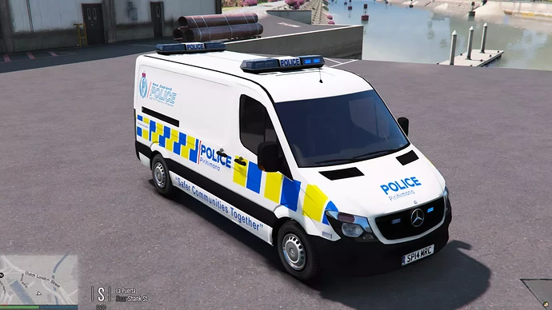
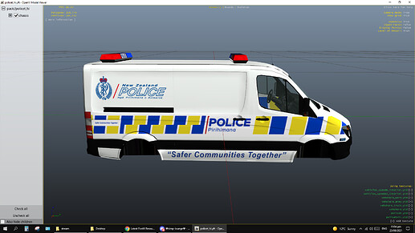
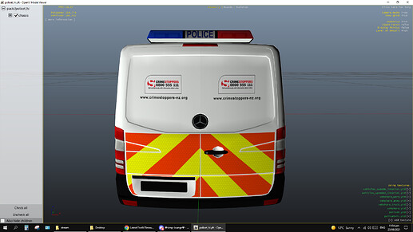
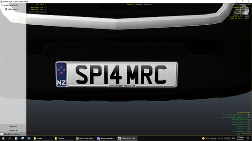

# NZPoliceVan

New Zealand retexture of 2014 Mercedes Sprinter

-------------------------------------

All credits to the model go to gta5-mods.com/users/BritishGamer88 and their team.

# Credits

- Model : 3D Model’s - ChrisR
- Poly’s Lowered - Tim
- GTAIV Author - BritishGamer88n
- Edited Futher For IV - BritishGamer88
- Converted over to GTAV - BritishGamer88
- Texture’s/Material’s - BritishGamer88
- Template - BritishGamer88
- Police Lightbar - Rockstar Games/ Edit to British version by BritishGamer88
- Grill Lights - Rockstar Games
- Oleg - for continuous help to get the model working ingame!!
- Original Skin - BritishGamer88
- Wheelss - Forza
- Police Cage - Kinksta100
- New Zealand ReSkin - TayMcKenzieNZ

-----------------------------

# Installation ⚙️

- Download zip folder

- Remove `-main` from folder name and rename it to `NZPDVan`

- Place in your `resources` folder or in a vehicle related folder in your FiveM server

- Add `NZPDVan` to your `server.cfg`

Enjoy

-----------------------------

# Screenshots

| | | |
|-|-|-|
|  |  |  |
|  |
